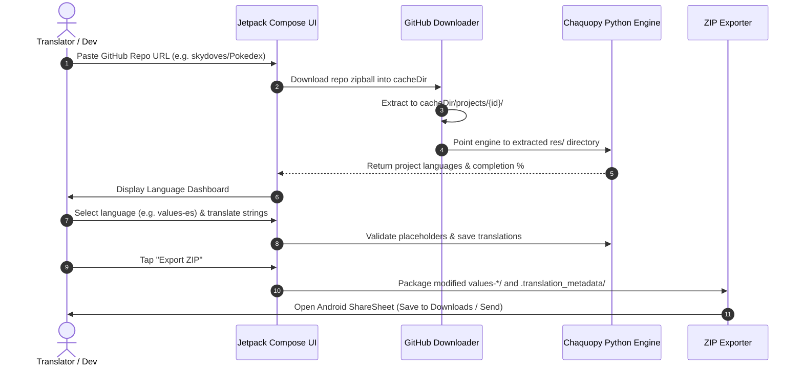

# Droidlate Mobile App - Project Context & Mission

## 1. Executive Summary

**Droidlate-app** is a native Android application designed to provide a seamless, mobile-friendly localization workspace for Android developers and translators.

It is built directly on top of the **Droidlate** Python engine ([github.com/estiaksoyeb/Droidlate](https://github.com/estiaksoyeb/Droidlate)), embedding it inside the Android application via **Chaquopy** (embedded CPython runtime) and a **Git Submodule**.

---

## 2. The Problem It Solves

### The Current CLI/Desktop Workflow:
1. Translating Android apps with standard tools requires setting up Python, running command-line terminals (or Termux), managing Git clones, resolving file ownership issues, and launching local web servers.
2. For non-technical translators and mobile users, running terminal commands or dealing with Git conflicts is a major barrier.

### The Mobile Solution (Droidlate-app):
1. **Zero-Configuration GitHub Ingestion:** Users simply paste a GitHub repo URL (e.g. `https://github.com/owner/repo` or `owner/repo`). The app downloads the repository zipball into the app's cache directory—no Git installation, no branch management, no credentials required.
2. **Interactive Native Material 3 UI:** A smooth Jetpack Compose interface to view all project languages, track progress, add new locales, and edit translations.
3. **Power of Droidlate's Engine:** Retains character-level XML formatting preservation, developer comment retention, `<plurals>` and `<string-array>` support, placeholder validation (`%1$s`, HTML tags), and auto-translation suggestions.
4. **Zero-Commit ZIP Export:** When done, users tap "Export ZIP". The app packages the modified `values-*/strings.xml` folders and `.translation_metadata/` sidecars and launches Android's native ShareSheet or file saver.

---

## 3. Technology Stack

* **Operating System:** Android 7.0+ (API 24+)
* **UI Framework:** Jetpack Compose (Material 3)
* **Language:** Kotlin 2.x
* **Core Localization Engine:** Embedded Python 3.11 (`droidlate` package) via **Chaquopy**
* **Engine Integration:** Git Submodule (`submodules/Droidlate`)
* **Networking & Ingestion:** OkHttp / Retrofit / Kotlin Coroutines
* **Storage:** Sandboxed App Internal Cache (`context.cacheDir/projects/`)
* **Archiving / Export:** Java/Kotlin `ZipInputStream` & `ZipOutputStream` + Android Storage Access Framework (SAF)

---

## 4. Key User Flow

