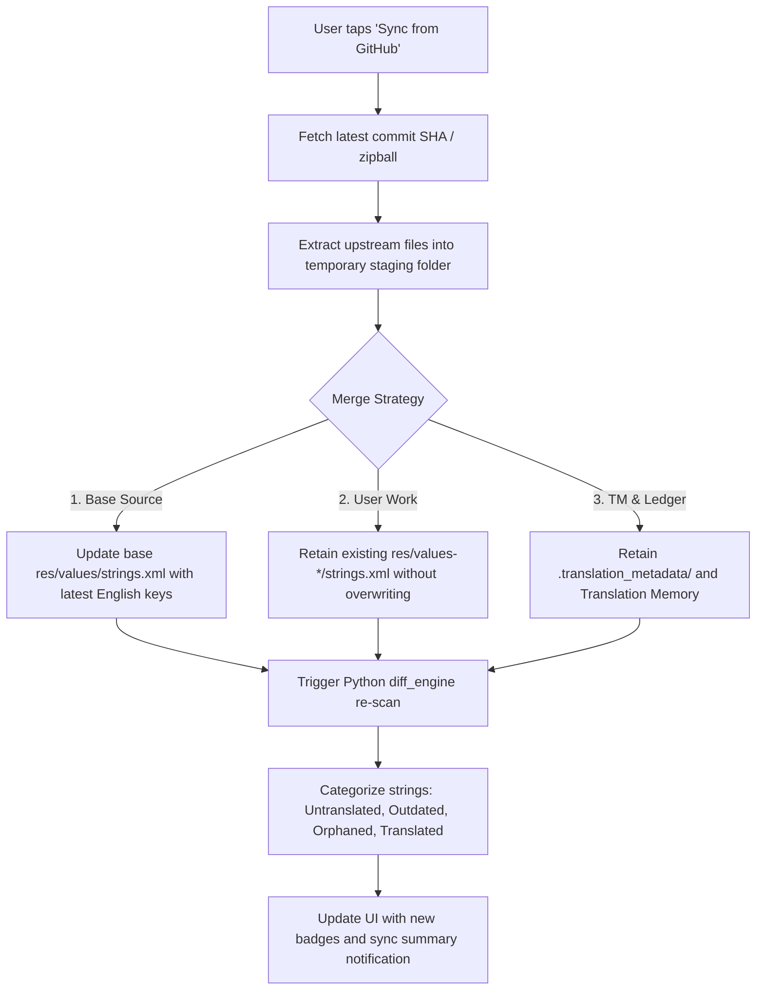

# Upstream Sync & Translation Preservation Plan

> **Specification & Architecture Plan for Upstream Repository Synchronization**
> How Droidlate pulls new upstream commits, detects changed/new strings, and 100% protects user translations.

---

## 1. Executive Summary & Goals

Android repositories frequently receive new commits that add, modify, or remove string resources in `res/values/strings.xml`.

### Core Goals:
1. **Zero Data Loss:** User translations in `res/values-*/` and metadata in `.translation_metadata/` are never overwritten by an upstream pull.
2. **Deterministic Diff Detection:** Automatically identify newly added strings, modified source strings (flagged as `outdated`), and deleted strings (flagged as `orphaned`).
3. **Seamless One-Tap Sync:** Translators tap "Sync from GitHub" on the Dashboard, and the workspace merges upstream changes instantly.

---

## 2. The Safe Sync Architecture



---

## 3. String Lifecycle During Upstream Sync

| Event in Upstream Git | Before Sync | After Sync | Engine Behavior & Safety |
| :--- | :--- | :--- | :--- |
| **New String Added** | Did not exist | `Untranslated` (Blue) | Automatically discovered; user translates it. |
| **English String Unchanged** | `Translated` | `Translated` (Green) | Hash matches; existing translation untouched. |
| **English String Modified** | `Translated` | `Outdated` (Yellow) | Hash mismatch; previous translation preserved in editor so user only edits the diff. |
| **English String Removed** | `Translated` | `Orphaned` (Red) | Target string kept safely; user can review or 1-tap "Prune". |
| **Placeholder Changed** (`%s` $\to$ `%d`) | `Translated` | `Warnings` (Yellow) | Real-time QA validator alerts translator of format mismatch. |

---

## 4. Implementation Steps & Algorithm

### Step 1: `GitHubDownloader.kt` Sync Method
```kotlin
suspend fun syncProject(project: ProjectInfo): SyncResult = withContext(Dispatchers.IO) {
    val stagingDir = File(context.cacheDir, "staging_${project.id}")
    try {
        // 1. Download latest archive to staging
        downloadAndExtractTo(project.coordinates, stagingDir)

        // 2. Locate upstream base res/values/strings.xml
        val upstreamSourceXml = findSourceXml(stagingDir)

        // 3. Backup user translations to memory / safety snapshot
        val activeRes = project.activeResDir
        val userLocales = activeRes.listFiles()?.filter { it.name.startsWith("values-") }

        // 4. Update base values/strings.xml in active workspace
        val localBaseXml = File(activeRes, "values/strings.xml")
        upstreamSourceXml.copyTo(localBaseXml, overwrite = true)

        // 5. Clean staging
        stagingDir.deleteRecursively()

        SyncResult.Success(newStringsCount, outdatedCount)
    } catch (e: Exception) {
        stagingDir.deleteRecursively()
        SyncResult.Error(e.message)
    }
}
```

### Step 2: Dashboard UI Action
* Add a **"Sync with GitHub"** button with a sync icon in the `DashboardScreen` TopAppBar.
* Displays a confirmation dialog showing current branch and warning-free preview.
* Shows a summary snackbar after sync:
  > *"Synced with upstream: +4 new strings, 2 outdated strings detected."*

---

## 5. Rollout Timeline
- [x] Engine support for hash diffing and metadata sidecars (`diff_engine.py`).
- [ ] Implement `syncProject()` in `GitHubDownloader.kt`.
- [ ] Add Sync action and confirmation modal in `DashboardScreen.kt`.
- [ ] Add sync summary notification with before/after stats.
